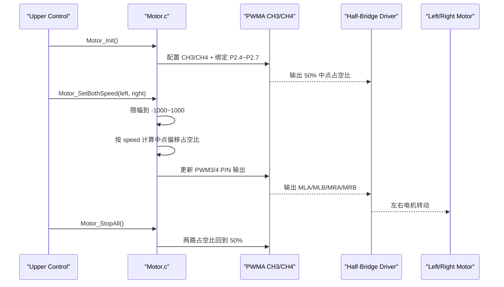

# Motor PWM 驱动

`Code_boweny/Device/Motor/` 使用 STC32G 的 PWMA CH3/CH4 控制左右两路直流电机。

## 硬件映射

| 电机 | 信号 | PWM 功能 | MCU 引脚 |
|------|------|----------|----------|
| 左电机 | MLA | `PWM3N_2` | `P2.5` |
| 左电机 | MLB | `PWM3P_2` | `P2.4` |
| 右电机 | MRA | `PWM4N_2` | `P2.7` |
| 右电机 | MRB | `PWM4P_2` | `P2.6` |

其中 `MLA/MRA` 由 `PWMxN` 驱动，`MLB/MRB` 由 `PWMxP` 驱动。当前板级使用半桥驱动芯片，`HIN/LIN#` 不是对称双输入，因此 `Motor` 层不再通过“正负速度切换 P/N 极性”来控向，而是固定板级极性映射，由 PWM 占空比围绕中点偏移。

## API

```c
void Motor_Init(void);
void Motor_SetSpeed(Motor_Id_t motor, int16 speed);
void Motor_SetBothSpeed(int16 left_speed, int16 right_speed);
void Motor_Stop(Motor_Id_t motor);
void Motor_StopAll(void);
int16 Motor_GetSpeed(Motor_Id_t motor);
```

速度范围为 `-1000 ~ +1000`，超出范围会自动限幅。

- `speed = 0` 时，占空比回到 `50%` 中点
- `speed > 0` 时，占空比在 `50%` 基础上上偏
- `speed < 0` 时，占空比在 `50%` 基础上下偏
- 当前实现保持 `PWMA CH3/CH4` 持续接管引脚，不再在停机时撤回到 GPIO 上拉态

## 控制时序图



## 使用示例

```c
#include "Motor.h"

Motor_Init();
Motor_SetBothSpeed(500, 500);     /* 双电机正转 50% */
Motor_SetSpeed(MOTOR_LEFT, -300); /* 左电机反转 30% */
Motor_StopAll();
```

## 接入注意事项

- `Motor_Init()` 会将 `PWM3` 切到 `P2.4/P2.5`，将 `PWM4` 切到 `P2.6/P2.7`。
- 本模块使用 `PWMA`，不占用 Timer0/Timer1/Timer2，也不修改 Driver 层源码。
- 若启用 `APP_PWMA_Output` 或其他使用 `PWMA CH3/CH4` 的示例，会与本模块冲突。
- 若实测前进/后退方向与船体定义相反，应优先在上层运动语义里调整，不要直接改 Driver 层 PWM API。
