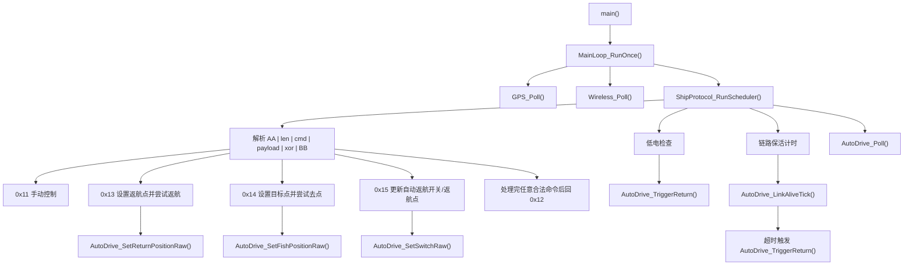

# 返航与循迹逻辑整理

这份文档只回答一件事：当前工程和老工程在返航/去点/GPS 回传上，到底要求什么数据格式，哪些地方必须严格对齐，哪些地方不能随便改。

对照版本：

- 当前工程：`Black_Pearl_v1.1`
- 老工程：`ship_Gps_V2.1_20260406-115200`
- 这次确认的“GPS 格式正确”参考提交：`0c972b1`，时间是 `2026-05-07 14:27:18 +0800`

最关键结论先写在前面：

1. `0x12` GPS 回传和 `0x13/0x14/0x15` 点位下发都按大端处理。
2. `0x12` 必须按老工程回传格式发，否则手持/上位机会把经纬度显示错。
3. `0x13/0x14/0x15` 必须按遥控器协议的大端点位格式收，否则返航/去点会解析错点位。
4. 返航能不能真正跑起来，除了字节序，还取决于 GPS、卫星数、距离门槛是否满足。
5. 当前记录：GPS 定点巡航链路已经按老工程格式修正；在 GPS 有效、卫星数达标、目标距离在门槛内时，返航点和钓点巡航可以正常使用。

当前说明边界：

- 本文重点描述 `0x12/0x13/0x14/0x15` 和返航/去点字节序、门槛条件。
- 电机最终输出链不在这里定义，当前统一由 `ShipControl` 仲裁。
- D 键北向校准属于导航航向零点修正，和这里的点位格式说明互补，但不是同一层逻辑。

---

## 1. 当前工程调用关系



补充：

- `ShipProtocol_RunScheduler()` 内部还负责 D 键双击检测、E 键取消与 `NorthCalib` busy 门控。
- `AutoDrive_Poll()` 只负责目标航向规划、距离判断和状态推进；不直接维护第二套电机差速逻辑。

---

## 2. 当前工程关键协议要求

## 2.1 `0x12` GPS 回传要求

`0x12` 是船发给手持/上位机的 GPS 状态帧，固定 `15` 字节 payload。

当前工程已经按老工程 `0c972b1` 对齐，要求如下：

| 偏移 | 字段 | 长度 | 要求 |
|------|------|------|------|
| `0` | `sat_count` | 1 | 优先用 `satellites_used_gsa`，否则 `satellites_used`，最大截到 `24` |
| `1..2` | `angle` | 2 | `GPS course` 的整数角度，`高字节在前` |
| `3` | `lon_dir` | 1 | 固定写 `'E'` |
| `4..5` | `lon1` | 2 | 经度整数段 `dddmm`，`高字节在前` |
| `6..7` | `lon2` | 2 | 经度小数段 `mmmm`，`高字节在前` |
| `8` | `lat_dir` | 1 | 固定写 `'W'` |
| `9..10` | `lat1` | 2 | 纬度整数段 `ddmm`，`高字节在前` |
| `11..12` | `lat2` | 2 | 纬度小数段 `mmmm`，`高字节在前` |
| `13` | `power_level` | 1 | 电量等级 `0..4` |
| `14` | `auto_state` | 1 | `0=未自动驾驶`，`1=返航`，`2=去目标点` |

### 重要说明

1. `0x12` 的 5 个 `u16` 字段：
   - `angle`
   - `lon1`
   - `lon2`
   - `lat1`
   - `lat2`
   都必须是 `高字节在前`。

2. `0x12` 的方向字节不能写真实半球。
   老手持解析就是按固定字节位读的，当前工程也必须继续发：
   - 经度方向固定 `'E'`
   - 纬度方向固定 `'W'`

3. 真正的南北/东西半球信息仍然保留在运行日志里，用于调试，不放进 `0x12` 方向字节。

4. `angle` 目前严格对齐 `0c972b1`：
   - 直接使用 `gps->course_deg_x100 / 100U`
   - 不再混用当前 AHRS/融合航向

5. 坐标优先级：
   - 优先使用 `GPS.c` 解析出的 `legacy_lon1/lon2/lat1/lat2`
   - 如果原始 NMEA 拆分不可用，再由 `deg1e7` 反算成旧格式 `dddmm.mmmm / ddmm.mmmm`

### `0x12` payload 示例布局

```text
byte0   sat_count
byte1   angle_H
byte2   angle_L
byte3   'E'
byte4   lon1_H
byte5   lon1_L
byte6   lon2_H
byte7   lon2_L
byte8   'W'
byte9   lat1_H
byte10  lat1_L
byte11  lat2_H
byte12  lat2_L
byte13  power_level
byte14  auto_state
```

### 看到 GPS 格式错误时优先检查什么

1. 上位机/手持是不是把 `0x12` 的 `u16` 字段按小端解了。
2. 有没有把 `lon_dir/lat_dir` 改成真实 `E/W/N/S`。
3. 有没有把 `angle` 又改回 AHRS/融合航向。

---

## 2.2 `0x13` 设置返航点要求

`0x13` 是手持/上位机发给船端的返航点，下发 payload 固定 `10` 字节。

这里按遥控器协议的大端点位格式收，也就是 `高字节在前`。

| 偏移 | 字段 | 长度 | 要求 |
|------|------|------|------|
| `0` | `lon_dir` | 1 | `'E'` 或 `'W'` |
| `1..2` | `lon_whole` | 2 | `高字节在前` |
| `3..4` | `lon_frac` | 2 | `高字节在前` |
| `5` | `lat_dir` | 1 | `'N'` 或 `'S'` |
| `6..7` | `lat_whole` | 2 | `高字节在前` |
| `8..9` | `lat_frac` | 2 | `高字节在前` |

payload 布局：

```text
byte0   lon_dir
byte1   lon_whole_H
byte2   lon_whole_L
byte3   lon_frac_H
byte4   lon_frac_L
byte5   lat_dir
byte6   lat_whole_H
byte7   lat_whole_L
byte8   lat_frac_H
byte9   lat_frac_L
```

收到后调用：

- `AutoDrive_SetReturnPositionRaw()`

---

## 2.3 `0x14` 设置目标点要求

`0x14` 是钓点/目标点命令，和 `0x13` 完全同格式，也是 `10` 字节，也是 `高字节在前`。

船端不保存钓点表，收到 `0x14` 后只把本帧坐标作为本次临时目标点。

收到后调用：

- `AutoDrive_SetFishPositionRaw()`

---

## 2.4 `0x15` 自动返航开关/返航点要求

`0x15` 有两种常见长度：

1. `1` 字节：改自动返航开关，并在开启状态下尝试按当前返航点返航
2. `11` 字节：开关 + 返航点；有效返航点会保存为返航原点，再在开启状态下尝试返航

### 只带开关时

```text
byte0   auto_ret_onoff
```

### 带返航点时

```text
byte0   auto_ret_onoff
byte1   lon_dir
byte2   lon_whole_H
byte3   lon_whole_L
byte4   lon_frac_H
byte5   lon_frac_L
byte6   lat_dir
byte7   lat_whole_H
byte8   lat_whole_L
byte9   lat_frac_H
byte10  lat_frac_L
```

这里返航点的 4 个 `u16` 也必须是 `高字节在前`。

开关语义：

- `0x30`：关闭自动返航
- `!= 0x30`：开启自动返航，并立即尝试用当前返航点启动返航

收到后调用：

- `AutoDrive_SetSwitchRaw()`
- 若 `auto_ret_onoff != 0x30`，随后调用 `AutoDrive_TriggerReturnWithReason()`

---

## 3. 为什么现在统一按大端

这次以遥控器协议为准：我们这里就是大端协议。

当前工程统一成：

1. `0x12` 回传：`高字节在前`
2. `0x13/0x14/0x15` 下发：`高字节在前`
3. `0x16` 诊断上报里的点位字段：`高字节在前`

这样上位机/遥控器按同一种点位格式组包，船端日志、返航原点保存、返航、去钓点都会按同一个数值解释。

---

## 4. 返航能否工作的真正门槛

决定“能不能返航”的关键点有两个：

1. 点位字节序必须一致
2. GPS/卫星/距离门槛必须满足

### 4.0 当前可用状态记录

当前工程已经修正 GPS 定点巡航的关键链路：

- `0x12` GPS 回传继续使用老工程 `dddmm.mmmm / ddmm.mmmm` 格式。
- `0x13/0x14/0x15` 下发点位按遥控器协议大端解析。
- `AutoDrive_PointFromGps()` 已修正 `deg*1e7 -> ddmm.mmmm` 的换算比例，当前 GPS 点不会再把“分”缩小 10 倍。
- `AutoDrive_IsCanActive()` 进入返航/去钓点前使用当前有效 GPS 点计算距离，并同步刷新 `g_idle_position`。
- `AutoDrive_Poll()` 现在用 GPS 当前点和目标点持续计算目标航向、距离；到目标点 `< 3m` 判定到达。
- 航向修正已经改为 PID 自稳定设置角度：目标航向来自 GPS 点位规划，电机差速复用遥控自稳模式的 yaw-hold 链路。
- 左右电机极性、差速限幅、陀螺阻尼和输出斜坡都在 `ShipControl_RequestGpsNav()` / `ShipControl` yaw-hold 链路中沿用自稳模式，不在 AutoDrive 内单独判断。
- 自稳航向不可用时停止电机，不再开环直行兜底。
- 老工程风格的“定时左/右转修正”已经去掉，不再用 `turn_times` 倒计时转弯。

所以现在按代码链路判断，GPS 定点巡航已经具备正常使用条件。实际使用仍必须满足下面门槛：GPS 有效、卫星数不少于 7、目标距离大于 10m 且小于 800m、当前不在自动驾驶状态。

### 4.1 点位字节序必须一致

如果 `0x13/0x14/0x15` 收到的点位解析错了，会出现：

- 存进去的返航点经纬度异常
- 计算距离异常
- 计算方向异常
- 看起来收到命令了，但就是不进入返航/去点

如果 `0x12` 回传字节序错了，会出现：

- 手持/上位机显示经纬度错位
- 显示出来的角度不对
- 但不一定影响船端自己返航

### 4.2 GPS/卫星/距离门槛必须满足

当前工程进入返航/去点前，会经过 `AutoDrive_IsCanActive()`，要求至少满足：

- 当前状态必须是 `AUTO_DRIVE_IDLE`
- 目标点方向有效：经度方向必须是 `E/W`
- 目标点经度整数段不能为 `0`
- 当前 GPS 可用
- 卫星数至少 `7`
- 当前经纬度不能全零
- 当前点到目标点距离 `> 10m`
- 当前点到目标点距离 `< 800m`

所以“收到了 `0x13`”不等于“一定返航”。

---

## 5. 当前工程与老工程对齐状态

## 5.1 已严格对齐老工程的部分

- `0x12` 的 `u16` 字段已恢复成老工程 `高字节在前`
- `0x12` 的角度来源已恢复成老工程 `GPS course`
- `0x12` 的方向字节继续固定 `'E'` / `'W'`
- `0x13/0x14/0x15` 点位收包已统一为遥控器协议大端，也就是 `高字节在前`
- `0x13/0x14/0x15` 收到后都走当前 `AutoDrive` 真实入口

## 5.2 不能再随便改的点

1. 不要把 `0x12` 的 `u16` 改成低字节在前。
2. 不要把 `0x13/0x14/0x15` 的点位 `u16` 改成低字节在前。
3. 不要把 `0x12` 的方向字节改成真实半球。
4. 不要把 `0x12` 的角度源换成 AHRS/融合航向后又不更新手持协议。
5. 不要以为“回传格式正确”就等于“返航一定会跑”，还要检查 GPS 门槛。

---

## 6. 联调时建议怎么验

## 6.1 验 `0x12`

看上位机/手持是否按下面方式解包：

```text
angle = (byte1 << 8) | byte2
lon1  = (byte4 << 8) | byte5
lon2  = (byte6 << 8) | byte7
lat1  = (byte9 << 8) | byte10
lat2  = (byte11 << 8) | byte12
```

如果它按下面这种解，就一定错：

```text
angle = (byte2 << 8) | byte1
```

## 6.2 验 `0x13/0x14/0x15`

看上位机发点位时是否按下面方式组包：

```text
lon_whole_H, lon_whole_L
lon_frac_H,  lon_frac_L
lat_whole_H, lat_whole_L
lat_frac_H,  lat_frac_L
```

如果它发成低字节在前，船端存点就会错。

## 6.3 验返航门槛

发完点位后，如果没返航，优先查：

1. 当前 GPS 是否有效
2. 卫星数是否 `>= 7`
3. 当前点和目标点距离是否在 `10m ~ 800m`
4. 当前状态是否已经不在 `AUTO_DRIVE_IDLE`

---

## 7. 关键文件

当前工程：

- `Code_boweny/Device/WIRELESS/ship_protocol.c`
- `Code_boweny/Device/AutoDrive/autodrive.c`
- `Code_boweny/Device/GPS/GPS.c`
- `Code_boweny/Device/AutoDrive/autodrive_cfg.c`

老工程：

- `ship_Gps_V2.1_20260406-115200/App/Wireless/wirelessProtocal.c`
- `ship_Gps_V2.1_20260406-115200/App/AutoDrive/autoDrive.c`

## 8. 本次文档更新目的

这份 README 现在明确写死了下面这条规则，后面改协议时必须先看这里：

- `0x12`：显示协议，`高字节在前`
- `0x13/0x14/0x15`：下发点位协议，`高字节在前`

只要把这条弄反，马上就会出现：

- 手持显示经纬度错误
- 上位机存点错误
- 返航/去点不生效
