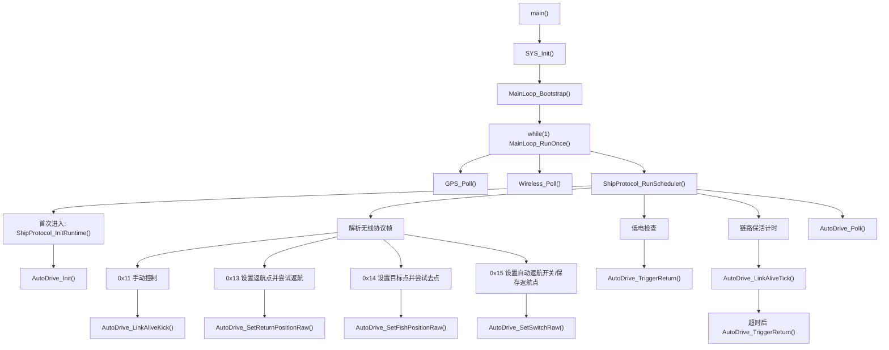
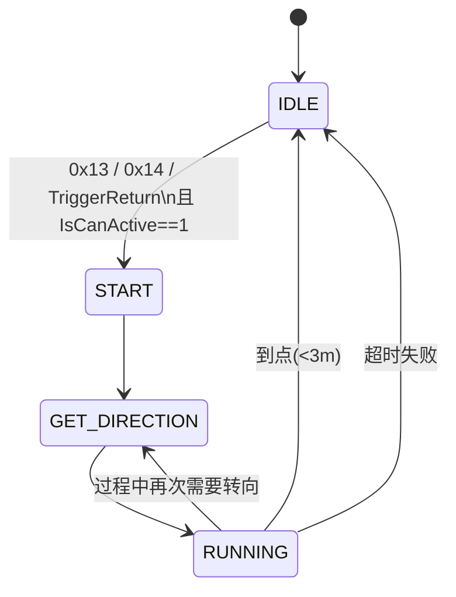
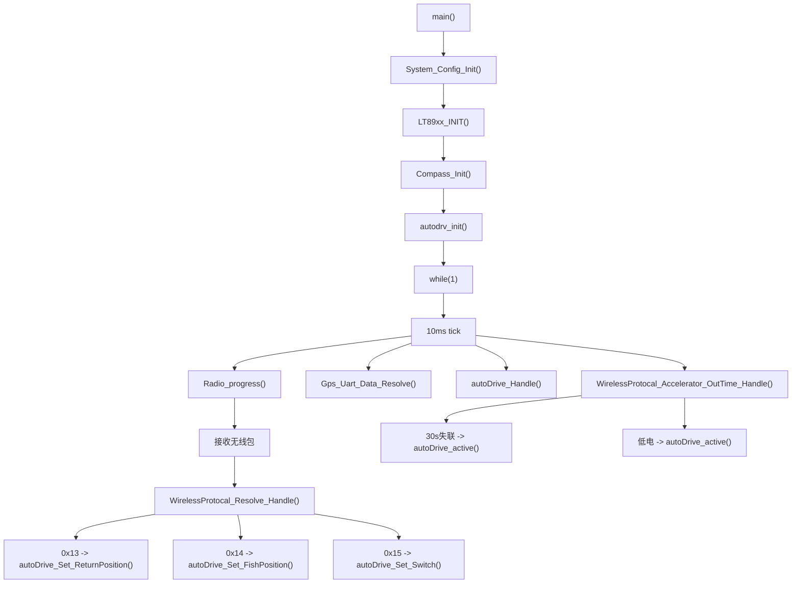
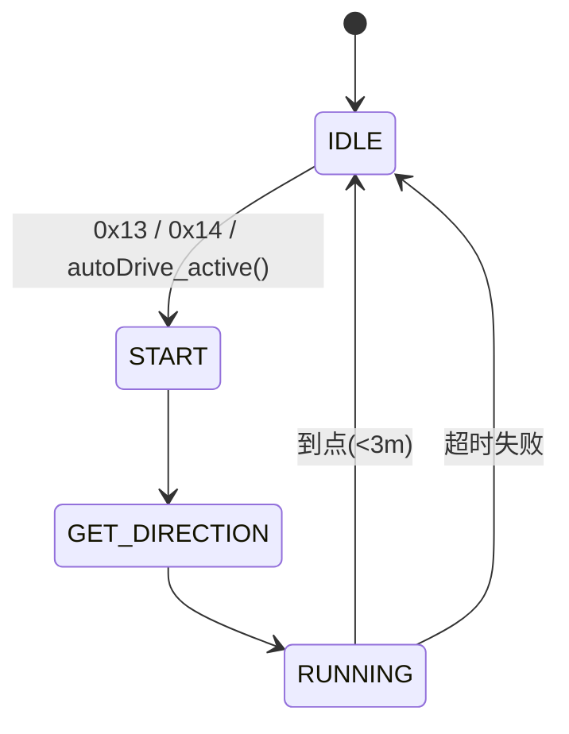

# 返航与循迹逻辑整理

这份文档把两个版本的返航/去点逻辑单独拎出来：

- 当前工程：`Black_Pearl_v1.1`
- 老工程：`ship_Gps_V2.1_20260406-115200`

重点只看三件事：

- 返航/去点命令是从哪里收进来的
- 关键数据字段长什么样
- 状态机是怎么启动、运行、退出的

---

## 1. 当前工程逻辑

### 1.1 调用链总图

当前工程里，返航不是独立主循环，而是挂在 `ShipProtocol` 调度里跑。



### 1.2 当前工程关键接收数据

#### A. `0x13` 设置返航点并立即尝试返航

payload 长度：`10` 字节

```text
byte0   lon_dir         'E' / 'W'
byte1   lon_whole_L
byte2   lon_whole_H
byte3   lon_frac_L
byte4   lon_frac_H
byte5   lat_dir         'N' / 'S'
byte6   lat_whole_L
byte7   lat_whole_H
byte8   lat_frac_L
byte9   lat_frac_H
```

说明：

- 当前工程现在已经对齐老工程
- 这 4 个 `u16` 字段按“低字节在前”解析
- 也就是原始 `GPS_POSITION` 内存字节布局

#### B. `0x14` 设置目标点并立即尝试去点

payload 格式和 `0x13` 完全一样，也是 `10` 字节点位。

#### C. `0x15` 设置自动返航开关 / 保存返航点

payload 有两种常用长度：

- `1` 字节：只改开关
- `11` 字节：开关 + 返航点

```text
byte0   auto_ret_onoff
byte1   lon_dir
byte2   lon_whole_L
byte3   lon_whole_H
byte4   lon_frac_L
byte5   lon_frac_H
byte6   lat_dir
byte7   lat_whole_L
byte8   lat_whole_H
byte9   lat_frac_L
byte10  lat_frac_H
```

开关语义：

- `0x30`：关闭自动返航
- `!= 0x30`：允许自动返航触发

#### D. `0x12` 上报给遥控/上位机的 GPS 状态

当前工程发出去的 `0x12` 也是老格式，关键是它和 `0x13/0x14/0x15` 现在已经一致。

payload 长度：`15` 字节

```text
byte0   sat_count
byte1   angle_L
byte2   angle_H
byte3   lon_dir
byte4   lon_whole_L
byte5   lon_whole_H
byte6   lon_frac_L
byte7   lon_frac_H
byte8   lat_dir
byte9   lat_whole_L
byte10  lat_whole_H
byte11  lat_frac_L
byte12  lat_frac_H
byte13  power_level
byte14  auto_state
```

这点很关键：

- `0x12` 回传是老格式
- `0x13/0x14/0x15` 接收现在也按老格式
- 所以“回传点位再原样存回去”这条链现在是通的

#### E. `0x16` 上报给上位机的返航诊断状态

这是当前工程新增的诊断上行帧，专门给上位机显示和落盘记录用。

payload 固定 `36` 字节：

```text
byte0   diag_version           当前为 0x01
byte1   autodrive_state
byte2   autodrive_mode
byte3   auto_ret_onoff
byte4   fail_flag
byte5   last_reason
byte6   gps_ready
byte7   sat_count
byte8   can_activate_target
byte9   reserved
byte10  distance_to_target_L
byte11  distance_to_target_H
byte12  current_heading_L
byte13  current_heading_H
byte14  target_heading_L
byte15  target_heading_H
byte16  current_point[0]
...
byte25  current_point[9]
byte26  target_point[0]
...
byte35  target_point[9]
```

其中：

- `current_point[10]` 和 `target_point[10]` 都是老工程点位格式
- 也就是：
  `dir + whole_L + whole_H + frac_L + frac_H + dir + whole_L + whole_H + frac_L + frac_H`

`last_reason` 当前约定：

- `0` 无
- `1` 收到 `0x13`
- `2` 收到 `0x14`
- `3` 收到 `0x15` 并保存返航点
- `4` 链路超时触发返航
- `5` 低电触发返航
- `6` 通用返航触发
- `7` 到点结束
- `8` 超时失败
- `9` 主动停止/关闭

### 1.3 当前工程返航启动条件

进入返航/去点前，会过 `AutoDrive_IsCanActive()`。

必须同时满足：

- 当前状态是 `AUTO_DRIVE_IDLE`
- 目标点合法：`lon_dir` 必须是 `E/W`，`lon_whole != 0`
- 当前 GPS 点合法
- 卫星数 `>= 7`
- 当前经纬度不为 `0`
- 当前点到目标点距离 `> 10m`
- 当前点到目标点距离 `< 800m`

自动返航触发入口有两类：

- 主动命令触发：`0x13`
- 被动触发：
  - 低电时 `AutoDrive_TriggerReturn()`
  - 链路超时约 `30s` 时 `AutoDrive_TriggerReturn()`

### 1.4 当前工程状态机



状态说明：

- `IDLE`：待机，持续刷新当前 GPS 位置为 idle 点
- `START`：刚启动，先计算目标大方向
- `GET_DIRECTION`：先原地/小角度修正方向
- `RUNNING`：边跑边根据新 GPS 点修正航向

### 1.5 当前工程航向来源

当前工程现在已经按“老工程思路”拆成两段：

1. `START` 起步调头阶段：

   - 优先用 `AHRS` 朝向，作为老工程罗盘角 `nowAveAngel` 的等价来源
   - 如果 `AHRS` 不可用，再退回 `GPS course`
   - 都不可用时按 `0` 度处理

2. `RUNNING` 运行修正阶段：

   - 优先用 `GPS course`
   - 如果 `GPS course` 不可用，再退回“上一点 -> 当前点”的点位差分航向

这和老工程的原意基本一致：

- 起步先看罗盘/姿态角
- 跑起来优先看 GPS 角度
- GPS 角度拿不到再用两次 GPS 点差来估算

---

## 2. 老工程逻辑

### 2.1 调用链总图

老工程是典型 10ms 超级循环，返航逻辑直接在主循环里跑。



### 2.2 老工程关键接收数据

老工程 `0x13 / 0x14 / 0x15` 的点位格式本质上也是同一套 `GPS_POSITION` 原始字节流。

#### A. `0x13` 设置返航点

老工程直接：

```c
memcpy((uint8_t *)&returnPosition, data_m, sizeof(GPS_POSITION));
```

也就是说：

- 根本没有大端/小端转换
- 收到什么字节，就按结构体原样落进去

#### B. `0x14` 设置目标点

同样直接：

```c
memcpy((uint8_t *)&fishPosition, data_m, sizeof(GPS_POSITION));
```

#### C. `0x15` 设置开关并保存返航点

老工程逻辑：

```c
autodrv_cfg.auto_ret_onoff = data_m[0];
memcpy((uint8_t *)&autodrv_cfg.ret_point, &data_m[1], sizeof(GPS_POSITION));
```

这里要注意一件事：

- 老工程默认假设 `0x15` payload 足够长
- 它没有像当前工程这样先检查 `len >= 11`

#### D. 老工程 `0x12` GPS 上报

老工程发 `0x12` 时，也是把各个 `uint16_t` 直接 `memcpy` 进 payload。

所以老工程的本质规则是：

- 上报坐标：原始结构体字节序
- 接收点位：原始结构体字节序
- 存点：原始结构体字节序

这就是老工程能正常返航的根本原因。

### 2.3 老工程返航启动条件

老工程 `autoDrive_is_can_active()` 的门槛和当前工程非常接近：

- 当前状态必须是 `AUTO_DRIVE_IDLE`
- 目标点经度方向必须是 `E/W`
- `jingdu_Left != 0`
- `idle_Gps_Position.jingdu_Left != 0`
- GPS 卫星数 `>= 7`
- 距离 `> 10m`
- 距离 `< 800m`

自动返航触发来源：

- 收到 `0x13`
- `WirelessProtocal_Accelerator_OutTime_Handle()` 检测到失联约 `30s`
- 低电时调用 `autoDrive_active()`

### 2.4 老工程状态机



状态名称和当前工程基本一致：

- `AUTO_DRIVE_IDLE`
- `AUTO_DRIVE_START`
- `AUTO_DRIVE_GET_DIRECTION`
- `AUTO_DRIVE_RUNING`

### 2.5 老工程航向来源

老工程偏“传统 GPS/罗盘混合”：

- 起步方向更依赖罗盘平均角 `nowAveAngel`
- 运行中优先取 `nmea41_Get_Angel()`
- GPS 角度不可用时，再退回用两次 GPS 点差计算航向

和当前工程相比：

- 老工程没有现在这套 AHRS 优先级封装
- 当前工程航向接口更规整

---

## 3. 当前版和老版的核心差异

### 3.1 已经对齐的部分

- `0x13 / 0x14 / 0x15` 点位接收格式已经对齐老工程
- 当前工程现在按老工程那种原始字节流解释点位
- 因此和 `0x12` 回传格式重新一致
- `START` 起步调头优先级已经调回老工程思路
- `RUNNING` 运行中航向来源已经调回“GPS 优先，点差兜底”
- “位移太小先直跑”的门槛已经调回老工程那种 1 米级判断

### 3.2 仍然存在的架构差异

- 当前工程把返航挂进 `ShipProtocol_RunScheduler()`
- 老工程是在 10ms 超级循环里直接跑 `autoDrive_Handle()`
- 当前工程航向源更偏 `GPS + AHRS`
- 老工程航向源更偏 `GPS + 罗盘`
- 当前工程 `0x15` 存点前会检查长度
- 老工程默认 `0x15` 一定带完整点位

### 3.3 对返航能否工作的影响

真正决定“能不能返航”的最关键点有两个：

1. 点位字节序必须一致
2. GPS/卫星/距离门槛必须满足

如果要继续往“返航跑得像不像老工程”这条线看，下一层关键点是：

3. 起步调头时的朝向来源要接近老工程
4. 运行中航向修正优先级要接近老工程

当前工程现在已经把这 4 点都收回到老工程思路附近了。

---

## 4. 关键文件

当前工程：

- `User/Main.c`
- `User/MainLoop.c`
- `Code_boweny/Device/WIRELESS/ship_protocol.c`
- `Code_boweny/Device/AutoDrive/autodrive.c`
- `Code_boweny/Device/AutoDrive/autodrive_cfg.c`
- `Code_boweny/Device/GPS/GPS.c`

老工程：

- `ship_Gps_V2.1_20260406-115200/App/Main/main.c`
- `ship_Gps_V2.1_20260406-115200/App/Wireless/wirelessProtocal.c`
- `ship_Gps_V2.1_20260406-115200/App/AutoDrive/autoDrive.c`
- `ship_Gps_V2.1_20260406-115200/App/Gps/nmea41_protocal.h`
